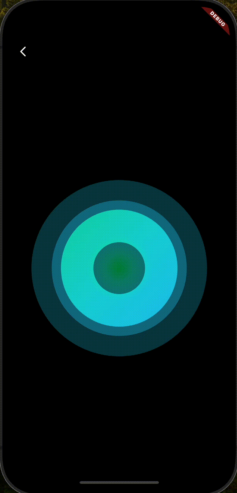

# Flutter Interactive UI example


## 1. Instagram Circle Checker


- `CustomPainter` + `animatedBuilder` 사용
- `animationValue`(double)를 구간별로 나눔. 0 ~ 0.5 사이로는 원을 그리고, 0.5 이후로는 체크를 그리도록 설정

```dart

// circle_checker_painter.dart

 if (animationValue <= 0.5) {
      canvas.drawCircle(
        Offset(
          size.width / 2,
          size.height / 2,
        ),
        1 + min(animationValue * size.width, size.width / 2),
        paint,
      );
    } else {
      canvas.drawCircle(
        Offset(size.width / 2, size.height / 2),
        size.width / 2,
        paint,
      );
    }

    if (animationValue <= 0.75) {
      double t = (animationValue - 0.5) / 0.25;
      Offset(
        startPoint.dx + (centerPoint.dx - startPoint.dx) * t,
        startPoint.dy + (centerPoint.dy - startPoint.dy) * t,
      );
      startPoint.dx + (centerPoint.dx - startPoint.dx) * t;
      startPoint.dy + (centerPoint.dy - startPoint.dy) * t;
    } else {
      path.moveTo(startPoint.dx, startPoint.dy);
      path.lineTo(centerPoint.dx, centerPoint.dy);
      double t = (animationValue - 0.75) / 0.25;
      final intermediatePoint = Offset(
        centerPoint.dx + (endPoint.dx - centerPoint.dx) * t,
        centerPoint.dy + (endPoint.dy - centerPoint.dy) * t,
      );
      path.lineTo(intermediatePoint.dx, intermediatePoint.dy);
    }
    canvas.drawPath(path, checkPaint);
```

- Duration을 달리주거나, `animationValue`를 어떻게 구간별로 나눠서 그려주느냐에 따라 체크가 다르게 보인다. -> 이 부분은 이것저것 변경해 보면서 UI에 가장 적절한 모션을 찾아가야할 듯 하다.


[참고 | locked님 velog](https://velog.io/@locked/Flutter-3%EC%9D%BC-%EC%A7%80%EB%82%9C-%EC%9D%B8%EC%8A%A4%ED%83%80-%ED%94%BC%EB%93%9C)


<br>

## 2. Bouncing Credit card
<div>


</div>


(gif라 화질이 구리고.. 전환 속도도 느리다. 
실제로는 `milliseconds: 1000` 이라 저것보다는 빠르다.)

- `animation`의 변하는 값을 이용해, 광원효과와 함께 카드를 비트는 효과를 `Matrix4`로 주었다.
- Gradient의 Alignment에 `animation.value` 값을 사용한다. Alignment는 -1.0부터 1.0까지의 값을 가진다. 면의 중앙(`Alignment.center`)을 기준으로 위치를 정한다. Offset 좌표계로 Alignment를 정한다면, x 좌표의 위치와 y 좌표의 위치를 각각 -1.0 ~ 1.0 의 값으로 변환을 해주어야 한다.

```dart
// bouncing_card.dart
// 여기서는 animation.value를 직접 사용해서, offset을 사용하지 않음
Alignment(
 (offset.dx / MediaQuery.of(context).size.width) * 2 - 1,
 (offset.dy / MediaQuery.of(context).size.height) * 2 - 1,
),
```

<br>

- Offset 좌표값의 변화를 `animation.value`로 컨트롤하는 방법을 알게 되었다. 
- `canvas`로 이미지를 그리는 거에 비해 특별히 어렵거나 복잡하진 않다. 다만 더 자연스럽고 부드러운 광원효과나 Hover 효과를 구현하기 위해서는 3D 변환에 주로 쓰이는 `Matrix4` 를 연구해 볼 필요가 있을 것 같다.


[참고 | locked님 velog](https://velog.io/@locked/Flutter-%EA%B7%B8%EB%9D%BC%EB%8D%B0%EC%9D%B4%EC%85%98%EC%9C%BC%EB%A1%9C-%EB%A7%8C%EB%93%A4%EC%96%B4%EB%B3%B4%EB%8A%94-%EA%B4%91%EC%9B%90-%ED%9A%A8%EA%B3%BC)


<br>

## 3. Viewer Setting (1) : 글자 크기, 줄 간격, 좌우 여백, 문단 여백


- e-book 뷰어에 있는 간단하지만 유저를 위한 편의 기능인 뷰어 보기 설정을 만들어 보았다
- 항상 참고하는 [looked님 블로그](https://velog.io/@locked/Flutter-%EB%B0%80%EB%A6%AC%EC%9D%98-%EC%84%9C%EC%9E%AC-%EB%94%B0%EB%9D%BC%ED%95%98%EA%B8%B0) 의 drawer floating 기능 부분에서 자연스러운 애니메이션 적용을 하는 것이 관건인데, 이 부분은 다음 파트에서 추가할 예정이다.
- `GestureDetector`의 `onHorizontalUpdate` 파라미터로 반환받는 `details` 값을 활용한다면 터치나 드래그로 인한 변화를 다룰 때 유용하다. 

(1) 상대적인 drag 기준(`details.delta.dx`): 드래그 변화량을 처리하고 싶을 때

(2) 해당 영역의 절대적 영역 기준(`details.localPosition.dx`): 터치가 발생한 위치를 위젯 기준으로 처리하고 싶을 때

(3) 디바이스의 절대 영역 기준(`details.globalPosition.dx`): 터치가 발생한 위치를 화면 전체 기준으로 처리하고 싶을 때

- 컴포넌트 구성은 `localPosition`을 기준으로 `dragValue`를 구하고, 각각 몇 `min`, `max`, `step`을 설정해주었다.
  
```dart
// custom_scroll_bar.dart

  return GestureDetector(
      onHorizontalDragUpdate: (DragUpdateDetails details) {
        setState(() {
          double dragValue = details.localPosition.dx;
          _scrollValue = calculateSize(
            dragValue: dragValue,
            min: widget.min,
            max: widget.max,
            step: widget.step,
          );
          if (widget.onChanged != null) {
            // 외부에서 받아서 처리
            widget.onChanged!(_scrollValue);
          }
        });
      },
      ...
  )
```
```dart
// custom_scroll_bar.dart
  double calculateSize({
    required double dragValue,
    required num step,
    required double min,
    required double max,
  }) {
    /// 몇 단계로 구성할 것인지 dragStep: 1 ~ 10단계로 구성
    int dragStep = (dragValue / 10).round();

    /// dragStep을 몇 스텝마다 나눌 것인지 설정 ex) 0.1 step -> 0.1, 0.2, 0.3 ...
    double size = dragStep * step.toDouble();

    if (size < min) size = min;
    if (size > max) size = max;
    return size;
  }
```

[참고 | locked님 velog](https://velog.io/@locked/Flutter-%EB%B0%80%EB%A6%AC%EC%9D%98-%EC%84%9C%EC%9E%AC-%EB%94%B0%EB%9D%BC%ED%95%98%EA%B8%B0)


<br>

## 4.Rolling Dice


3D 큐브는 이미 구현된 코드라, 이것을 보고 어떤 부분이 어떤 역할을 담당하는지 파악하는 것을 중점적으로 했다.


1. 라디안(Radian) 측정
   - 라디안은 회전의 각도를 측정할 때 사용하는 단위로, 수학적 단위인 pi를 주로 사용한다. 
   - 180도 = 1pi 라디안 / 360도 = 2pi 라디안
   - 큐브가 회전을 하므로, 회전 각도를 구해서 보여지는 x, y, z 면의 비율과 찌그러짐 정도(`rotate`)를 정한다

2. _side 위젯 톺아보기
```dart
Widget _side({
    bool moveZ = true, // 일정 기준에 따라 z축을 기준으로 움직일지 판단
    double xRot = 0.0, // x축 로테이션
    double yRot = 0.0, // y축 로테이션
    double zRot = 0.0, // z축 로테이션
    double shadow = 0.0, // 음영
    required int number, // 보여질 주사위의 숫자 (커스텀)
    required Color color, // 면의 색상 (커스텀)
  }) {
    return Transform(
      alignment: Alignment.center,
      transform: Matrix4.identity()
        ..rotateX(xRot) // 입력받은 x축 로테대로 비틀고
        ..rotateY(yRot) // 입력받은 y축 로테대로 비틀고
        ..rotateZ(zRot) // 입력받은 z축 로테대로 비틀고
        // ..setEntry(3, 2, 0.001)
        ..translate(0.0, 0.0, moveZ ? -size / 2 : size / 2), // size는 외부에서 입력받는 값으로 한 면의 사이즈, moveZ 요건에 따라 이동
      child: Container(
        alignment: Alignment.center,
        child: Container(
          constraints: BoxConstraints.expand(width: size, height: size),
          color: color,
          padding: const EdgeInsets.all(18),
          foregroundDecoration: BoxDecoration(
            color: Colors.black.withOpacity(rainbow ? 0.0 : shadow),
            border: Border.all(
              width: 0.8,
              color: rainbow ? color.withOpacity(0.3) : Colors.black26,
            ),
          ),
          child: drawDiceDots(number), // 주사위 점
        ),
      ),
    );
  }
```
* 전체 코드는 `screens > rolling_dice.dart` 참고


3. Rolling Animation
- `AnimationController`를 자주 쓰기 때문에 mixin으로 만들어 두었는데, 웬걸 MultiTicker을 필요로 하는 바람에, 내장된 `TickersProviderMixin`을 이용했다.
```dart
  @override
  void initState() {
    super.initState();
    initAmination();
  }

    @override
  void dispose() {
    animationController.dispose();
    super.dispose();
  }
  

 void initAmination() {
    animationController = AnimationController(
      vsync: this,
      duration: const Duration(milliseconds: 2000),
    );
    animation = Tween<double>(begin: 0.0, end: pi * 2).animate(
      CurvedAnimation(
        parent: animationController,
        curve: Curves.easeInOut,
      ),
    );
    animationY = Tween<double>(begin: 0.0, end: pi * 2).animate(
      CurvedAnimation(
        parent: animationController,
        curve: Curves.easeInOut,
      ),
    );

    animationController.addListener(() {
      setState(() {
        _x = animation.value;
        _y = animationY.value;
      });
    });

    animationController.addStatusListener((AnimationStatus status) {
      if (status == AnimationStatus.completed) {
        animationController.reverse();
      } else if (status == AnimationStatus.dismissed) {
        animationController.forward();
      }
    });
  }
```
- 내가 봤을 때, 이 `pi * 2` 즉 360도 value 가 가장 안정적인 회전인 것 같다. 회전 각도를 달리하거나 회전 방향을 비틀고 싶으면 아래 코드에서 `end` 쪽을 랜덤하게 변경해도 된다.
`animation = Tween<double>(begin: 0.0, end: pi * 2)`


[참고 | 3D cube codepen](https://codepen.io/knezzz/pen/bGVqpzY)
[참고 | locked님 velog](https://velog.io/@locked/Flutter-%EC%A3%BC%EC%82%AC%EC%9C%84%EB%A5%BC-%EA%B5%B4%EB%A0%A4%EB%B3%B4%EC%9E%90)


## 5. Naver Green Dot (VUI) 동작
[Naver Developers](https://developers.naver.com/docs/clova/client/Design/UI/Voice_User_Interface.md#GreenDot)

일상생활에서 네이버 앱을 사용하면서 자연스럽게 지나쳤던 인터렉션들이 있다.
음악 듣기나, 음성 듣기 혹은 버튼을 눌렀을 때 효과가 그렇다.
자세한 가이드라인이 있어서, 인터렉티브 UI를 만들어보는 연습으로 구현해보기에 나쁘지 않아서 참고했다.


(작업 중)
|**입력 전**|**준비**|**대기(Waiting)**|
|------|---|---|
|테스트1|테스트2|테스트3|
|**듣기(Listening)**|**분석/처리(Processing)**|**대답(Answering)**|
|테스트1|테스트2||
